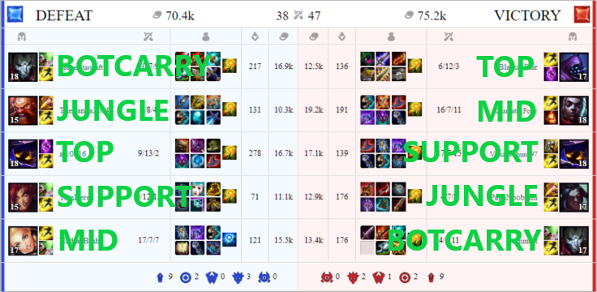
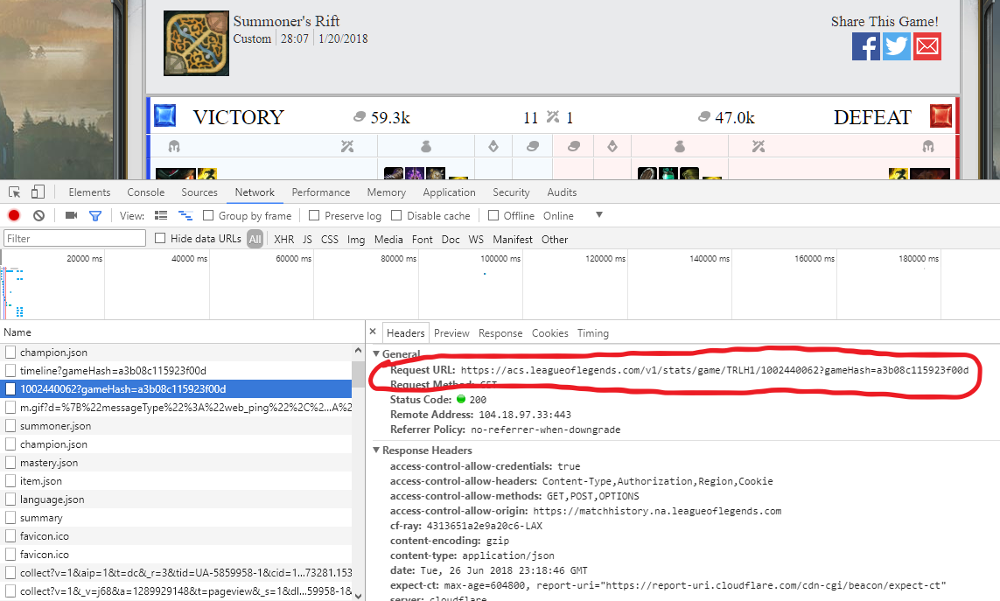

---
title:

output: 
  revealjs::revealjs_presentation:
    theme: league
    css: exec_report_style.css
    slide_level: 2
---
```{r setup, include=FALSE}
knitr::opts_chunk$set(echo = TRUE)
```

<div>
  
  <p class="subtitle-text">
    KN YUR RE
  </p>
</div>
<div>
  <p>Ryan Transfiguracion</p>
  <p>July 23, 2018</p>
</div>

## Links

- This slide presentation: <a href="https://ryanthtra.github.io/league-of-legends-know-your-role/ExecutiveReport.html" target="_blank">ryanthtra.github.io/league-of-legends-know-your-role/ExecutiveReport.html</a>
- Final report (website): <a href="https://ryanthtra.github.io/league-of-legends-know-your-role/" target="_blank">ryanthtra.github.io/league-of-legends-know-your-role/</a> 
- Final report (PDF): <a href="https://github.com/ryanthtra/league-of-legends-know-your-role/blob/master/FinalReport.pdf" target="_blank">github.com/ryanthtra/league-of-legends-know-your-role/blob/master/FinalReport.pdf</a>

## Outline

- Background
- Team Roles
- The Problem
- The Data
- Exploratory Analysis
- Machine Learning Models
- Conclusion
- The Future and Recommendations

# Background

## What is League of Legends?

>- A free-to-play, multiplayer online battle arena (MOBA) videogame
>- Developed and published by Riot Games
>- ~100 million active players a month
>- ~100k viewers during peak hours on Twitch.tv
>- Active and popular professional eSports scene
>- Numerous 3rd party websites and books on gameplay strategies

## How is League of Legends Played?


>- Primary mode: Summoner's Rift
>- 5 vs. 5 human players, plus AI minions for each team
>- Main objective: destroy enemy's base (aka The Nexus)
>- Sub-objectives: destroy enemy's defense turrents
>- Key objectives: slay dragons and Baron Nashor for boosts

## How is League of Legends Played?


>- Players select 1 of 141 champions to represent them
>- Each champion has unique set of attributes and abilities
>- Gain power by accumulating: XP to level up, and gold to buy enhancement items
>- Accumulate XP/gold by killing minions, monsters, and enemy players, and taking objectives
>- Killed players must wait before respawn

# Team Roles

## What are Team Roles?


>- In standard team composition, each player is designated one of fives roles based on:
>- Their champion's attributes and abilities
>- Their intended location on the map near start of a match (around 1:25-1:30) -- called the laning phase
>- The Roles: Top Laner, Jungler, Mid Laner, Botlane Carry, Support

##  Top Laner


- Fights in the top lane of the map during laning phase
- Key attributes/responsibilities: front line tankiness, deal moderate-to-high damage, ability to safely initiate team fights

##  Jungler


- Fights in the jungle areas of the map during laning phase
- Key attributes/responsibilities: ability to efficiently kill most jungle monsters during laning phase, provide ganks for in-lane teammates, place wards on map
- Can deal high burst damage to neutral monsters via Smite

##  Mid Laner


- Fights in the middle lane of the map during laning phase
- Key attribute/responsibility: deal high burst, ability power-based damage
- Champion is usually a mage or an assassin

##  Botlane Carry 


- Fights in the bottom lane of the map during laning phase
- Key attributes/responsibilities: back line squishiness, deal high sustained attack damage, be the highest damage dealer in match
- Champion is usually ranged (e.g., guns, arrows, etc.)

##  Support


- Fights/assists in the bottom lane of the map during laning phase
- Key attributes/responsibilities: help Botlane Carry survive and achieve kills, provide healing, shielding, and/or other utilities during team fights, place wards on map

# The Problem

## The Problem

>- Humanly impossible to visually observe every match and record team roles manually.
>- ***Can we use match data and machine learning to distinguish all five team roles from each other?***

## Team Roles -- Match Overview, Draft Pick Format


## Assumed Team Roles -- Draft Pick Match

```{r echo = FALSE, results = "asis"}
library(knitr)
TeamRole <- c("TOP", "JUNGLE", "MID", "BOTCARRY", "SUPPORT")
BlueTeam <- c(1,2,3,4,5)
RedTeam <- c(6,7,8,9,10)
df_roles <- data.frame(TeamRole, BlueTeam, RedTeam)
kable(df_roles, caption = "Assumed Team Role Participant IDs -- Draft Pick Match")
```

## Team Roles -- Match Overview, Blind Pick Format



## Team Roles -- NA LCS 2018 Spring Split, All Matches

```{r echo=FALSE, message = FALSE, results = "asis"}
library(dplyr)
nalcs_season_match_data <- read.csv(
  "datasets/nalcs/nalcs_spring2018_match_player_stats.csv") %>% 
  mutate(roleLane = paste(role, lane, sep = ", "))
table_roles <- table(nalcs_season_match_data$roleLane, nalcs_season_match_data$teamRole)
kable(table_roles, caption = "Predicted Roles (Rows) vs. Actual/Assumed Roles (Columns)")
```
```{r echo = FALSE}
remove(nalcs_season_match_data)
```

# The Data

## Data Overview


>- Data for all matches in the 2018 Spring Split seasons of the North America LoL Championship Series (NALCS), the Europe LoL Championship Series (EULCS), LoL Champions Korea (LCK), and LoL Master Series (LMS), plus the 2018 Mid-Season Invitational (MSI)
>- Each match data accessed using API domain https://acs.leagueoflegends.com/v1/stats/game/


## Obtaining API and Match IDs




## Sample Collection of Match IDs

```{r echo=FALSE, message = FALSE}
library(knitr)
kable(head(read.csv("gameid_data/NALCS_Spring2018.csv")) %>% select(c(1:5)), caption = "Match ID Data, First Six Matches of NA LCS 2018 Spring Split")
```

## Cleaning Each Match for Player Stats

>- JSON response object contains two sub-objects (```participants``` and ```participantIdentities```) that contain indvidual player stats
>- ```participantIdentities``` contains 10 players' usernames under sub-object ```player```
>- ```participants``` contains two more sub-objects (```stats``` and ```timeline```)
>- basically, ```participants``` is flattened out, then joined with ```player```
>- final product for single match is 10 rows and  nearly 150 columns/variables
>- process repeated for all other matches, and tables are concatenated together 

## Synopsis of Match Player Datasets

- NA LCS: 117 matches, 1170 observations
- EU LCS: 115 matches, 1150 observations
- LCK: 246 matches, 2460 observations
- LMS: 144 matches, 1440 observations
- MSI: 74 matches, 740 observations

## Sample of MSI 2018 Match Player Dataset

```{r echo=FALSE, message=FALSE}
library(knitr)
kable(sample_n(read.csv("datasets/msi/msi_2018_match_player_stats.csv"), 12) %>% select(c(summonerName,kills,deaths,assists,totalDamageTaken)))
```

## Creating Player Per-Match Average Datasets

>- Observations from the match player datasets are grouped together by team, player name, and then assumed team role
>- Each group's variables' statistics are calculated to mean (average) values. 

## Sample of MSI 2018 Player Per-Match Average Dataset

```{r echo=FALSE, message=FALSE}
library(knitr)
kable(sample_n(read.csv("datasets/msi/msi_2018_season_summoner_avgs.csv"), 12) %>% select(c(summonerName,kills,deaths,assists,totalDamageTaken)))
```

# Exploratory Analysis

## Box Plots 1

```{r echo=FALSE, message=FALSE}
library(tidyr)
library(ggplot2)
nalcs_matches_player_avgs <- nalcs_matches_player_avgs <- read.csv("datasets/nalcs/nalcs_spring2018_season_summoner_avgs.csv")
nalcs_matches_player_avgs %>%
  gather(kills, assists, key = "varName", 
         value = "valuePerGame") %>%
  filter(wins + losses >= 6) %>%
  ggplot() +
  geom_boxplot(mapping = aes(x = teamRole, y = valuePerGame, fill = teamRole), 
               size = 1.00, alpha = .6) +
  geom_jitter(width = 0.15, mapping = aes(x = teamRole, y = valuePerGame, color = teamRole)) +
  facet_wrap(~ varName, scales = "free", ncol = 2) +
  theme(axis.text.x = element_text(angle=15, vjust=0.6)) +
  labs(
    title = "Player Averages per Game Box Plots, NALCS 2018 Spring Split",
    subtitle = "Distribution Across Team Roles")
```

## Box Plots 2

```{r echo=FALSE, message=FALSE}
#### Facet-wrapped plots
nalcs_matches_player_avgs %>%
  gather(magicDamageDealtToChampions, physicalDamageDealtToChampions, key = "varName", 
         value = "valuePerGame") %>%
  filter(wins + losses >= 6) %>%
  ggplot() +
  geom_boxplot(mapping = aes(x = teamRole, y = valuePerGame, fill = teamRole), 
               size = 1.00, alpha = .6) +
  geom_jitter(width = 0.15, mapping = aes(x = teamRole, y = valuePerGame, color = teamRole)) +
  facet_wrap(~ varName, scales = "free", ncol = 2) +
  theme(axis.text.x = element_text(angle=15, vjust=0.6)) +
  labs(
    title = "Player Averages per Game Box Plots, NALCS 2018 Spring Split",
    subtitle = "Distribution Across Team Roles")
```

## Box Plots 3

```{r echo=FALSE, message=FALSE}
#### Facet-wrapped plots
nalcs_matches_player_avgs %>%
  gather(neutralMinionsKilled, timeCCingOthers, key = "varName", 
         value = "valuePerGame") %>%
  filter(wins + losses >= 6) %>%
  ggplot() +
  geom_boxplot(mapping = aes(x = teamRole, y = valuePerGame, fill = teamRole), 
               size = 1.00, alpha = .6) +
  geom_jitter(width = 0.15, mapping = aes(x = teamRole, y = valuePerGame, color = teamRole)) +
  facet_wrap(~ varName, scales = "free", ncol = 2) +
  theme(axis.text.x = element_text(angle=15, vjust=0.6)) +
  labs(
    title = "Player Averages per Game Box Plots, NALCS 2018 Spring Split",
    subtitle = "Distribution Across Team Roles")
```

## Box Plots 4

```{r echo=FALSE, message=FALSE}
#### Facet-wrapped plots
nalcs_matches_player_avgs %>%
  gather(totalUnitsHealed, visionWardsBoughtInGame, key = "varName", 
         value = "valuePerGame") %>%
  filter(wins + losses >= 6) %>%
  ggplot() +
  geom_boxplot(mapping = aes(x = teamRole, y = valuePerGame, fill = teamRole), 
               size = 1.00, alpha = .6) +
  geom_jitter(width = 0.15, mapping = aes(x = teamRole, y = valuePerGame, color = teamRole)) +
  facet_wrap(~ varName, scales = "free", ncol = 2) +
  theme(axis.text.x = element_text(angle=15, vjust=0.6)) +
  labs(
    title = "Player Averages per Game Box Plots, NALCS 2018 Spring Split",
    subtitle = "Distribution Across Team Roles")
```

# Machine Learning Models

## Feature Set for Machine Learning 1

```{r echo = FALSE, results = "asis"}
library(knitr)
variableName <- c("kills", "assists", "magicDamageDealt", "physicalDamageDealt", 
                  "magicDamageDealtToChampions", "physicalDamageDealtToChampions", 
                  "totalHeal")
description <- c("The number of enemy champions killed.", 
"The number of enemy champions assisted in killing.", 
"The amount of magic damage dealt.", 
"The amount of physical damage dealt.", 
"The amount of magic damage dealt to enemy champions only.",
"The amount of physical damage dealt to enemy champions only.", 
"The amount of health points the player has regained.")
df_vars <- data.frame(variableName, description)
kable(df_vars)
```

## Feature Set for Machine Learning 2

```{r echo = FALSE, results = "asis"}
library(knitr)
variableName <- c("totalUnitsHealed", "damageSelfMitigated", "totalDamageTaken",  
                  "neutralMinionsKilled", "timeCCingOthers", "totalTimeCrowdControlDealt", 
                  "champLevel")
description <- c( 
"The number of entities a player healed.", 
"The amount of health points that were not lost from damage.", 
"The amount of damage a player took from various sources.", 
"The number of neutral monsters killed by a player.", 
"The weighted sum of all CC applied", 
"The sum of all CC applied", 
"The (experience) level of a player at the end of a match.")
df_vars <- data.frame(variableName, description)
kable(df_vars)
```

## Feature Set for Machine Learning 3
```{r echo = FALSE, results = "asis"}
library(knitr)
variableName <- c("visionWardsBoughtInGame", "wardsPlaced", "wardsKilled",
                  "physDmgToChampsToDmgTakenRatio", "totalMinionsKilled", 
                  "damageTakenPerMinDeltas.0.10", "creepsPerMinDeltas.0.10")
description <- c(
"The number of wards (i.e. surveillance items) a player purchased.", 
"The number of wards a player placed in the arena.", 
"The number of enemy wards  a player destroyed.",
"Physical damage dealt to champions / Total damage taken", 
"The number of enemy minions killed.", 
"The amount of damage taken per minute from 0:00 to 10:00 minutes.", 
"The number of enemy minions killed per minute from 0:00 to 10:00 minutes.")
df_vars <- data.frame(variableName, description)
kable(df_vars)
```

## Machine Learning Approach

1. Put together all five datasets for player per-match averages, then split the entire set into two subsets: one for training and one for testing.
2. Create/train a model using the **k-means** clustering algorithm on the training set.  Since we already know how many team roles exist, we set ```k=5```.
3. Test/validate the model using the **k-nearest-neighbor (knn)** classification algorithm on the testing set.  Since there are only five possible neighbors, and we want to classify each observation to exactly one group (team role), we set ```k=1```.

## Machine Learning Approach (continued)

4. Put together all five datasets for single match player stats.
5. Test the model using **knn** on the new dataset.
6. Evaluate performance of Steps 2, 3, and 5 using a **confusion matrix**.

Note: features are scaled using **z-score**.

## Training the Model

```{r echo=FALSE, message=FALSE, warning=FALSE}
library(dplyr)
# Import averages data for all available leagues
nalcs_season_summoner_avgs <- read.csv("datasets/nalcs/nalcs_spring2018_season_summoner_avgs.csv") %>% 
  select(-X) 
eulcs_season_summoner_avgs <- read.csv("datasets/eulcs/eulcs_spring2018_season_summoner_avgs.csv") %>% 
  select(-X)
lck_season_summoner_avgs <- read.csv("datasets/lck/lck_spring2018_season_summoner_avgs.csv") %>% 
  select(-X)
lms_season_summoner_avgs <- read.csv("datasets/lms/lms_spring2018_season_summoner_avgs.csv") %>% 
  select(-X)

# Putting all leagues together
all_leagues_summoner_avgs <-
  eulcs_season_summoner_avgs %>%
  bind_rows(lms_season_summoner_avgs) %>%
  bind_rows(lck_season_summoner_avgs) %>%
  bind_rows(nalcs_season_summoner_avgs) %>%
  # Removing players who haven't played at least six games.
  filter(wins + losses >= 6) 
remove(nalcs_season_summoner_avgs, eulcs_season_summoner_avgs, lck_season_summoner_avgs, lms_season_summoner_avgs)

nalcs_season_match_player_stats <- read.csv("datasets/nalcs/nalcs_spring2018_match_player_stats.csv") %>% select(-X)
eulcs_season_match_player_stats <- read.csv("datasets/eulcs/eulcs_spring2018_match_player_stats.csv") %>% select(-X)
lck_season_match_player_stats <- read.csv("datasets/lck/lck_spring2018_match_player_stats.csv") %>% select(-X)
lms_season_match_player_stats <- read.csv("datasets/lms/lms_spring2018_match_player_stats.csv") %>% select(-X)
msi_season_match_player_stats <- read.csv("datasets/msi/msi_2018_match_player_stats.csv") %>% select(-X)

all_leagues_match_player_stats <-
  nalcs_season_match_player_stats %>%
  bind_rows(eulcs_season_match_player_stats) %>%
  bind_rows(lck_season_match_player_stats) %>%
  bind_rows(lms_season_match_player_stats) %>%
  bind_rows(msi_season_match_player_stats) %>%
  mutate(roleLane = paste(role, lane, sep = ", "))

remove(nalcs_season_match_player_stats, eulcs_season_match_player_stats, lck_season_match_player_stats, lms_season_match_player_stats, msi_season_match_player_stats)

all_leagues_summoner_avgs <- all_leagues_summoner_avgs %>%
  mutate("physDmgToChampsToDmgTakenRatio" = physicalDamageDealtToChampions / totalDamageTaken)
all_leagues_match_player_stats <- all_leagues_match_player_stats %>%
  mutate("physDmgToChampsToDmgTakenRatio" = physicalDamageDealtToChampions / totalDamageTaken)
set.seed(1234)
train_index <- caret::createDataPartition(all_leagues_summoner_avgs$teamRole, p = 0.4, list = FALSE, times = 1)
train_avgs_data <- all_leagues_summoner_avgs[train_index,]
test_avgs_data <- all_leagues_summoner_avgs[-train_index,]

# Remove columns 1:6, 8, 10, 30:33, 41, 44:56 (Thus, using only 17 features.)
train_avgs_data_scaled <- train_avgs_data %>%
  select(kills, assists, magicDamageDealt, physicalDamageDealt, magicDamageDealtToChampions,
         physicalDamageDealtToChampions, totalHeal, totalUnitsHealed, damageSelfMitigated, 
         totalDamageTaken, neutralMinionsKilled, timeCCingOthers, totalTimeCrowdControlDealt, 
         champLevel, visionWardsBoughtInGame, wardsPlaced, wardsKilled,
         totalMinionsKilled, damageTakenPerMinDeltas.0.10, 
         physDmgToChampsToDmgTakenRatio, creepsPerMinDeltas.0.10) %>%
  # Use z-value scaling of the features.
  scale()

# Using k-means on the training set to make centroids
set.seed(1234)
```

```{r message=FALSE, warning=FALSE}
train_fit.km <- kmeans(train_avgs_data_scaled, 5, iter.max = 1000)
```
```{r echo=FALSE, message=FALSE, warning=FALSE}
km_train_table <- table(train_fit.km$cluster, train_avgs_data$teamRole)
# Re-order the table rows for aesthetic purposes
km_train_table <- km_train_table[c(2,1,3,4,5),]
rownames(km_train_table) <- c("BOTCARRY", "JUNGLE", "MID", "SUPPORT", "TOP")
kable(km_train_table, row.names = TRUE, caption = 
        "k-means: Creating Training Model (Predicted Rows vs. Actual Columns)")
```

## Validating the Model

```{r echo=FALSE, message=FALSE, warning=FALSE}
# Using knn to classify observations in the test set
test_avgs_data_scaled <- test_avgs_data %>%
  select(kills, assists, magicDamageDealt, physicalDamageDealt, 
         magicDamageDealtToChampions, physicalDamageDealtToChampions, 
         totalHeal, totalUnitsHealed, damageSelfMitigated, totalDamageTaken, 
         neutralMinionsKilled, timeCCingOthers, totalTimeCrowdControlDealt, 
         champLevel, visionWardsBoughtInGame, wardsPlaced, wardsKilled,
         totalMinionsKilled, damageTakenPerMinDeltas.0.10, 
         physDmgToChampsToDmgTakenRatio, creepsPerMinDeltas.0.10) %>%
  # Use z-score scaling of the features.
  scale()
library(FNN)
set.seed(1234)
```
```{r message=FALSE, warning=FALSE}
knn_pred_test_avgs <- get.knnx(train_fit.km$centers, 
                               test_avgs_data_scaled, 1)$nn.index[, 1]
```
```{r echo=FALSE, message=FALSE, warning=FALSE}
knn_test_avgs_table <- table(knn_pred_test_avgs, test_avgs_data$teamRole)
knn_test_avgs_table <- knn_test_avgs_table[c(2,1,3,4,5),]
rownames(knn_test_avgs_table) <- c("BOTCARRY", "JUNGLE", "MID", "SUPPORT", "TOP")
kable(knn_test_avgs_table, row.names = TRUE, caption = 
        "knn: Predict Team Roles w/Per-Game Averages Test Data Set (Predicted Rows vs. Actual Columns)")
```

## Testing the Model (Individual Matches Dataset)

```{r echo=FALSE, message=FALSE, warning=FALSE}
# Using knn to classify all match-by-match individual performances
all_leagues_match_player_stats_scaled <- all_leagues_match_player_stats %>%
  select(kills, assists, magicDamageDealt, physicalDamageDealt, magicDamageDealtToChampions, 
         physicalDamageDealtToChampions, totalHeal, totalUnitsHealed, damageSelfMitigated, 
         totalDamageTaken, neutralMinionsKilled, timeCCingOthers, totalTimeCrowdControlDealt, 
         champLevel, visionWardsBoughtInGame, wardsPlaced, wardsKilled,
         totalMinionsKilled, damageTakenPerMinDeltas.0.10, 
         physDmgToChampsToDmgTakenRatio, creepsPerMinDeltas.0.10) %>%
  # Use z-value scaling of the features.
  scale()
set.seed(1234)
```
```{r message=FALSE, warning=FALSE}
knn_pred_test_single_games <- get.knnx(train_fit.km$centers,
                                       all_leagues_match_player_stats_scaled,
                                       k=1)$nn.index[, 1]
```
```{r echo=FALSE, message=FALSE, warning=FALSE}
knn_test_singles_table <- table(knn_pred_test_single_games,
                                all_leagues_match_player_stats$teamRole)
knn_test_singles_table <- knn_test_singles_table[c(2, 1, 3, 4, 5),]
rownames(knn_test_singles_table) <- c("BOTCARRY", "JUNGLE", "MID", "SUPPORT", "TOP")
kable(knn_test_singles_table, row.names = TRUE, caption = 
        "knn: Predict Team Roles Single Games Test Data Set (Predicted Rows vs. Actual Columns)")
```

## Confusion Matrix 

```{r echo=FALSE, message=FALSE, warning=FALSE}
library(caret)
confusionMatrix(knn_test_singles_table)
```

## Current Classification System

```{r echo=FALSE, message=FALSE, warning=FALSE}
table_roles <- table(all_leagues_match_player_stats$roleLane, all_leagues_match_player_stats$teamRole)
kable(table_roles, caption = "Predicted Roles (Rows) vs. Actual/Assumed Roles (Columns)")
```

# Conclusion

## Summary

>- 21 out of ~150 variables were chosen for model's feature set
>- **k-means** clustering on per-match averages training set was 100% accurate
>- Used centroids produced from clustering as the model for validation and testing sets
>- Model used for **knn** classification on per-match averages validation set was 100% accurate
>- Used same model on "real world" single match performances test set
>- **knn** classification on test set was 94.7% accurate

## Caveats / Limitations

>- Sample size vs. population
>- Patches ==> possible meta changes
>- Normal / Blind Pick / vs. AI modes are lower stakes
>- Unique champions (e.g. Vladimir, Swain, Gangplank, Ivern)
>- Varying levels of competition

# The Future and Recommendations

## The Future and Recommendations

>- Larger datasets: virtually endless number of non-custom matches can be accessed off of one username alone due to recursive nature of accessing match history.
>- Additional data (i.e., the ```timeline``` API using match IDs)
>- Alternative k-means training
>- Creating models per division
>- Creating models per patch

## Final Thoughts

>- Draft Pick game modes allow safe assumptions on team roles
>- Limits the number of matches analytics sites can use for analyzing champion and team role performances
>- While not absolutely perfect, model could provide excellent tool for classifying team roles in Blind Pick Summoner's Rift game modes,where team roles cannot be assumed based on Participant ID alone.