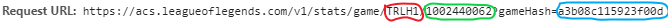

```{r setup, include=FALSE}
knitr::opts_chunk$set(echo = TRUE)
```
# Introduction
League of Legends (LoL) is a multiplayer online battle arena (MOBA) videogame by Riot Games.  The primary game mode for LoL is Summoner's Rift (also the name of the arena's map), in which two teams of five players vie to destroy their opponents' base, called the Nexus.  For more detailed information about the game, please see <a href="https://en.wikipedia.org/wiki/League_of_Legends#Gameplay" target="_blank">League of Legends on Wikipedia.</a>

Each player in a match chooses one of 141 unique avatars, called champions, to represent them, and each champion has its own unique blend of attributes, skills, and abilities.  Each one of these 141 champions is classified into one of six categories: assassin, fighter, mage, marksman, support, or tank.

Additionally, each player on each competing team in a match plays one of five standard team roles: ***Top Laner***, ***Jungler***, ***Middle (Mid) Laner***, ***Bottom Lane (Botlane) Carry***, or ***Support***.  While each role performs specific duties, each can also be identified by its location on the map near the beginning of a match.  See Figure 1 for reference.


The ***Top Laners*** traverse along the dirt path that travels along the west and north perimeters of the map.  Near the start of the match they usually combat enemy minions and each other at the northwest corner of the map.  This type of combat at the beginning of the match is called the **Laning Phase**.

The ***Mid Laners*** traverse along the dirt path that cuts straight across the diagonal of the map connecting the two opposing bases.  They, too, combat enemy minions and each other during the Laning Phase, where they typically compete right at the center of the map.

The ***Botlane Carries*** and ***Supports*** traverse along the dirt path that travels along the south and east perimeters of the map.  Their laning phase typically occurs at the southeast corner of the map.  The ***Botlane Carries*** deliver damage to their opponents and enemy minions, while the ***Supports*** play an auxiliary role by providing protection to their botlane teammates.

Finally, the ***Junglers*** traverse in the forest-like areas between the three lanes.  One team's jungle is in the west and south "triangles", while the other team's is in the north and east triangular areas.  During the Laning Phase the ***Junglers*** are combating the monsters that inhabit these areas.  They may occasionally encounter each other, especially if one Jungler "invades" their opponents' jungle areas.

Therefore, it's nearly as easy to identify team roles in a League of Legends match as it is to identify the nine positions of the defensive players in a baseball game.  The botlane is a little trickier, since both ***Carries*** and ***Supports*** are there, but by observing their behaviors during the laning phase the two roles are fairly simple to distinguish.

# The Problem
Sure, it's easy to identify team roles when observing a single match at a time, but it's not humanly possible to identify team roles for the hundreds, thousands, and millions of matches that have run through Riot Games' servers through eyeballs alone.  

Fortunately, Riot Games provides post-match data of teams and individual players for virtually all matches that go through their servers.  **Is it possible for a machine to take a sample of data from these matches and be able to distinguish all five team roles from each other?**


### Why Solving the Problem Matters

In the Summoner's Rift game modes for Classic 5v5 matches, Draft Pick and Ranked, because the players' selection of champions are done and revealed in a structured order, team roles are always assigned the same Participant IDs according to which side of the map the players are on:

```{r echo = FALSE, results = "asis"}
library(knitr)
TeamRole <- c("Top", "Jungle", "Mid", "BotCarry", "Support")
BlueTeam <- c(1,2,3,4,5)
RedTeam <- c(6,7,8,9,10)
df_roles <- data.frame(TeamRole, BlueTeam, RedTeam)
kable(df_roles, caption = 
        "Assumed Team Role Participant IDs -- Draft Pick, Ranked, eSports")
```

While nothing is preventing teammates from swapping team roles before a match or even during a match (e.g., a ***Top Laner*** picks Smite as a summoner spell or has the Unsealed Spellbook keystone rune and swaps their current summoner spell for Smite and becomes a de facto ***Jungler***), it's safe to assume that the assignment of these team roles are cemented in place.

However, in the other Summoner's Rift game mode, Blind Pick, the selection of all ten champions are done and revealed simultaneously, and, therefore, team roles cannot be assumed to be in the same Participant ID order, nor can it be assumed that the five distinct team roles exist on each side as a match proceeds.  For instance, one team may have two ***Junglers***, while the other team has no ***Junglers***.

Furthermore, while Riot Games appears to have a classification system in place for labeling a player in a certain lane and role, it has shown to be flawed, even in a game mode with an ordered champion selection as is the case in professional eSports matches.  Below is a table representing the NA LCS 2018 Spring Split team role classifications for all 117 matches (thus, 1170 classifications).  The column names are team roles that I manually entered according to Participant ID, while the row names represent a concatentation of the ```role``` and ```lane``` variables that Riot Games assigned and were obtained from the data set:


```{r message = FALSE, results = "asis"}
library(dplyr)
nalcs_season_match_data <- read.csv(
  "datasets/nalcs/nalcs_spring2018_match_player_stats.csv") %>% 
  mutate(roleLane = paste(role, lane, sep = ", "))
table_roles <- table(nalcs_season_match_data$roleLane, nalcs_season_match_data$teamRole)
kable(table_roles, caption = paste("NA LCS Spring Split 2018 Team Role Assignments ",
         "-- Predicted Roles (Rows) vs. Actual Roles (Columns)", sep=""))
```
```{r echo = FALSE}
remove(nalcs_season_match_data)
```

Not only are there ten different combinations of Role and Lane variables in this data set, but there are a large number of assumed roles being auto-classified into different roles.  

For instance, there are a significant number of ***Mid*** and ***Top Laners*** being assigned the ```NONE, JUNGLE``` ```role-lane``` combination.  This can be theorized in one way: Riot Games has a classification system in place that assigns players to a ```role-lane``` according to where they are located on the map at a certain point in time in a match, particularly early.   

One reason to make this theory is because there are two popular tactics used before the laning phase.  One is **counter-jungling** (invading the enemy ***Jungler***), and the other is **leashing** (providing early assistance to the ***Jungler*** teammate in killing their first jungle monster).  One or more non-Jungler teammates are optional for the former but required for the latter.  Therefore, when the time comes for the system to assign the ```role-lane```, those teammates who are still in the jungle may inadvertantly be assigned the ```NONE, JUNGLE``` ```role-lane``` combination.

While the auto-classification system has shown to be flawed, at least it's safe to assume team roles for Draft Pick, Ranked, and eSports matches due to the structure cited in Figure 1, and many third-party League of Legends analytics websites, such as [op.gg](http://na.op.gg), [champion.gg](https://champion.gg), and [mobalytics.gg](https://mobalytics.gg), appear to make that assumption.  However, these sites miss out on analyzing data from Blind Pick matches, in which team role assumptions cannot be made.  If the auto-classification system can be improved upon, then both Riot Games and these third-party websites can utilize this improved system for their future analytics.

# Diving into the Data
The datasets we'll be using to solve this problem were obtained and wrangled from the match data of the 2018 Spring Split seasons of four different professional Lol eSports leagues: the North Ameica LoL Championship Series (NALCS), the Europe LoL Championship Series (EULCS), LoL Champions Korea (LCK), and LoL Master Series (LMS), plus the 2018 Mid-Season Invitational (MSI), an international tournament similar to the UEFA Champions League in Football/Soccer.  Specifically, for solving the problem, we'll use datasets that contain individual performance data of all players of each match of the eSports Leagues' season, and we'll also use those datasets to create per-game performance datasets.

### Limitations

In the case of the NA LCS 2018 Spring Split, the season started using the Version 8.1 Patch of League of Legends, while the playoff finals series of the season used Version 8.5.  Other LoL eSports leagues around the world used roughly the same range of patches for their 2018 Spring Split seasons, while the 2018 MSI used Version 8.8.  

The reason I mention this, is because with every new patch Riot Games releases for LoL, the changes and tweaks to the game may possibly affect, to a significant degree, the metagame (or meta for short), which means the underlying strategies that can increase chances of success.

For instance, the 8.10 patch gave a significant increase of Experience Points for killing the Rift Scuttler, a non-hostile neutral minion that exists in The River (the diagonal opposite of the Mid Lane), which, in turn made selecting a Jungler champion that is strong at Level 2 for contesting the Scuttler, such as Graves or Xin Zhao, possibly more important.

Another significant meta-shifting patch was 8.11, which made marksman Botlane Carry champions, such as Ashe, Caitlyn, and Tristana, noticeably weaker both in damage output and durability.  This has not only made marksman champions much less prevalent in the Botlane Carry role, but champions once previously thought to be suitable for only Top Laner or Mid Laner roles are starting to make their presence known as Botlane Carries in the 2018 Summer Split, such as Heimerdinger, Vladimir, and Swain.

Therefore, it's possible that any classification models created from and used for the 2018 Spring Split matches will not be as effective if used on 2018 Summer Split or Patch 8.11+ matches.  

### Obtaining and Cleaning/Wrangling the data: 
In-depth details about how the data was obtained and wrangled can be found in this document: [**DataWranglingReport.pdf**](https://github.com/ryanthtra/lol-esports-data-analysis/blob/master/lol_pros_predictor/reports/DataWranglingReport.pdf).  Below, I will present the steps taken to reach the destination datasets used to solve the problem.

#### 1. Discovering the API for obtaining match data
eSports matches were found in [**lolesports.com**](https://www.lolesports.com).  While an individual match that has already concluded can easily be found by just clicking/tapping links alone, finding matches during the 2018 Spring Splits currently requires some manual hacking of the URL to reach them, such as [**NA LCS 2018 Spring Split Week 1**](https://www.lolesports.com/en_US/na-lcs/na_2018_spring/schedule/regular_season/1).

From here, we can click away to find an individual match's details, such as [**NA LCS 2018 Spring Split Week 1, Day 1, Team Liquid vs. TSM**](https://matchhistory.na.leagueoflegends.com/en/#match-details/TRLH1/1002440062?gameHash=a3b08c115923f00d&tab=overview).  On this page, we can get find the API we need by opening the browser's Web Inspector, as shown in Figure 1.


#### 2. Accumulating match IDs for the API
We can find the match IDs the same way we found the API.  Figures 3 and 4 show the match ID strings we need to obtain match data for a particular match.




Therefore, we can accumulate these match IDs by repeating step 1, and then copying and pasting the IDs into a CSV file, in which a portion of the NA LCS 2018 Spring Split is shown in table form below.

```{r message = FALSE}
library(knitr)
kable(head(read.csv("gameid_data/NALCS_Spring2018.csv")), 
      caption = "Match ID Data, First Six Matches of NA LCS 2018 Spring Split")
```

#### 3. Obtaining Match Data for an Entire Season
Below is the R code used to obtain the top-level match data for a few matches of the NA LCS 2018 Spring Split season.

```{r message=FALSE, warning=FALSE}
library(httr)
library(dplyr)
library(tidyr)
library(jsonlite)

acs_prefix_domain <- "https://acs.leagueoflegends.com"

# API call helper from response
process_uri <- function(str_uri) {
  #print(str_uri)
  response <- GET(str_uri)
  #print(response$status_code)
  while (response$status_code != 200) {
    Sys.sleep(2)
    response <- GET(str_uri)
  }
  json <- jsonlite::fromJSON(content(response, as = "text"))
  return(json)
}
```
\pagebreak
```{r message=FALSE, warning=FALSE}
# URI building helper function
get_acs_match_by_matchid <- function(chr_platform_id, 
                                     num_match_id, 
                                     chr_game_hash = "") {
  uri <- paste(acs_prefix_domain, "/v1/stats/game/",chr_platform_id, "/", num_match_id, 
               ifelse(chr_game_hash != "", 
                      paste("?gameHash=", chr_game_hash, sep = ""), ""), sep = "")
  return(process_uri(uri))
}

# Iterate through match IDs data frame
get_league_match_data_list <- function(league_matchid_df) {
  matchlist <- list()
  for (i in 1:nrow(league_matchid_df)) {
    matchlist[[i]] <- get_acs_match_by_matchid(
      league_matchid_df$Region.ID[[i]], league_matchid_df$Game.ID[[i]], 
      chr_game_hash = league_matchid_df$Hash.ID[[i]])
  }

  return(matchlist)
}

# Getting portion of NA LCS Spring Split matches data
nalcs_matches <- get_league_match_data_list(
  head(read.csv("gameid_data/NALCS_Spring2018.csv")))
str(nalcs_matches, max.level = 1)
```

We see that we are getting a list of match data.

Below, we see some details about a single match:
```{r message=FALSE}
str(nalcs_matches[[1]], max.level = 2)
```

#### 4. Wrangling and cleaning match data into desired datasets.

Here, we will iterate through each individual set of match data, clean it up so that we can get ten observations (representing the ten players in a match), and then concatenate those ten observations into an accumulative dataset.

```{r message=FALSE, warning=FALSE}
#### Creating data frame of champion names linked to their champion IDs.
ddragon_prefix_domain <- "https://ddragon.leagueoflegends.com"
get_champion_data_by_version <- function(chr_version_number = "8.8.2") {
  uri <- paste(ddragon_prefix_domain, "/cdn/", 
               chr_version_number, "/data/en_US/champion.json", sep = "")
  return(process_uri(uri))
}
# Champion data
champions_list <- get_champion_data_by_version()$data
champions_df <- data.frame(NULL)
for (i in 1:length(champions_list)) {
  champions_df <- champions_df %>% bind_rows(data.frame(champions_list[[i]]))
}
champions_df_simple <- champions_df %>%
  select(name, key) %>%
  distinct() %>%
  rename(championId = key) %>%
  mutate(championId = as.numeric(championId))
remove(champions_list)
remove(champions_df)

#@@@@@@@@@@@@@@@@@@@@@@@@@@@@@@@@@@@@@@@@@@@@@@@@@@@@@@@@@@@@
# Concatenates the "participants" DFs of each match together
# combine_teammate_stats determines whether we want to combine the stats of the teammates
# into total numbers 
get_accum_matches_participants <- function(league_matchlist, league_matchid_df, 
                                           combine_teammate_stats = FALSE) {
  league_matches_participants_accum <- data.frame(NULL)

  for (i in 1:length(league_matchlist)) {
    flattened_df <- get_flattened_match_participants_df(
      league_matchlist[[i]]$participants, 
      league_matchlist[[i]]$participantIdentities)
    flattened_df["gameNumber"] <- rep(i, 10)
    flattened_df["isTiebreaker"] <- rep(league_matchid_df[i,]$Tiebreaker, 10)
    flattened_df["isPlayoff"] <- rep(league_matchid_df[i,]$Playoff, 10)
    flattened_df["duration"] <- rep(league_matchlist[[i]]$gameDuration, 10)
    tmp_fdf1 <- flattened_df %>% filter(teamId == "Blue")
    tmp_fdf1["teamName"] <- unname(unlist(c(league_matchid_df[i, rep("Blue.Team", 5)])))
    tmp_fdf2 <- flattened_df %>% filter(teamId == "Red")
    tmp_fdf2["teamName"] <- unname(unlist(c(league_matchid_df[i, rep("Red.Team", 5)])))

    flattened_df <- bind_rows(tmp_fdf1, tmp_fdf2)

    flattened_df['teamRole'] <- NULL
    # Get team roles
    for (j in 1:nrow(flattened_df)) {
      if (flattened_df[j, 'participantId'] == 1 || 
          flattened_df[j, 'participantId'] == 6) {
        flattened_df[j, 'teamRole'] = "TOP"
      } else if (flattened_df[j, 'participantId'] == 2 || 
                 flattened_df[j, 'participantId'] == 7) {
        flattened_df[j, 'teamRole'] = "JUNGLE"
      } else if (flattened_df[j, 'participantId'] == 3 || 
                 flattened_df[j, 'participantId'] == 8) {
        flattened_df[j, 'teamRole'] = "MID"
      } else if (flattened_df[j, 'participantId'] == 4 || 
                 flattened_df[j, 'participantId'] == 9) {
        flattened_df[j, 'teamRole'] = "BOTCARRY"
      } else {
        flattened_df[j, 'teamRole'] = "SUPPORT"
      }
    }
    
    league_matches_participants_accum <- league_matches_participants_accum %>% 
      bind_rows(flattened_df)
  }

  return(league_matches_participants_accum)
}

#@@@@@@@@@@@@@@@@@@@@@@@@@@@@@@@@@@@@@@@@@@@@@@@@@@@@@@@@@@@@
get_flattened_match_participants_df <- function(match_participants_df, match_participantids_df) {
  # uses jsonlite flatten() function
  ret_df <- match_participants_df %>%
    select(-stats, - timeline) %>%
    bind_cols(match_participantids_df$player) %>%
    inner_join(champions_df_simple) %>%
    inner_join(match_participants_df$stats) %>%
    inner_join(match_participants_df$timeline %>%
                 flatten())
  # Change teamId = 100/200 to Blue/Red, replace NA's in the Deltas with 0s
  ret_df <- ret_df %>%
    mutate(teamId = replace(teamId, grepl('100', teamId), 'Blue')) %>%
    mutate(teamId = replace(teamId, grepl('200', teamId), 'Red'))

  return(ret_df)
}

# Note: just the first six matches
nalcs_season_match_player_data <- get_accum_matches_participants(
  nalcs_matches, head(read.csv("gameid_data/NALCS_Spring2018.csv")))
kable(nalcs_season_match_player_data[1:20,] %>%
        select(participantId, summonerName, win, kills, 
               deaths, assists, teamRole, role, lane), 
      caption = "Sample of Match-By-Match Player Data")
```

The table above shows just a portion of the data set we'll be using to solve this problem.  Additionally, we'll use this dataset to create the per-game averages performance dataset, as presented in the code below.

```{r message=FALSE, warning=FALSE}
# Gets individual per-game average performace data
get_league_season_summoner_avgs <- function(league_matches_player_stats) {
  league_season_participants_accum <- league_matches_player_stats

  # Create avg stats DF groups by lane and role
  league_season_participants_accum <-
  (league_season_participants_accum %>%
  group_by(teamName, summonerName, teamRole) %>%
  summarize_at(vars(duration, kills:assists, totalDamageDealt:trueDamageDealt, 
                    totalDamageDealtToChampions:firstBloodKill, 
                    firstTowerKill:firstInhibitorAssist, 'creepsPerMinDeltas.10.20', 
                    'creepsPerMinDeltas.0.10', 'xpPerMinDeltas.10.20', 
                    'xpPerMinDeltas.0.10', 'goldPerMinDeltas.10.20', 
                    'goldPerMinDeltas.0.10', 'damageTakenPerMinDeltas.10.20', 
                    'damageTakenPerMinDeltas.0.10'), mean)) %>%
  # Tallying wins and losses by summoner name
  inner_join(league_season_participants_accum %>%
    group_by(teamName, summonerName, teamRole, win) %>%
    tally() %>%
    spread(win, n) %>% # "transposes" the DF so that TRUE (win) and FALSE (loss) are the column names
    rename('losses' = 'FALSE', 'wins' = 'TRUE') %>% # renames the T/F columns to W/L
    mutate_at(vars(wins, losses), funs(replace(., is.na(.), 0))))

  # Adding KDA Ratio column
  league_season_participants_accum <- league_season_participants_accum %>%
    mutate(KDA = (kills + assists) / deaths)

  # Reordering columns - teamName, wins, losses, <everything else>
  league_season_participants_accum <- league_season_participants_accum[
    , c(1, 2, 55, 54, 3:7, 56, 8:53)]
}
nalcs_matches_player_stats <- read.csv(
  "datasets/nalcs/nalcs_spring2018_match_player_stats.csv")
nalcs_season_player_avgs <- get_league_season_summoner_avgs(nalcs_matches_player_stats)
kable(nalcs_season_player_avgs[1:20, 2:10], caption = 
        "Sample of Per Game Player Averages, NA LCS 2018 Spring Split")
```

# Exploratory Analysis
For additional details on the exploratory analysis of the datasets see this document: [**ExploratoryAnalysisReport.pdf**](https://github.com/ryanthtra/lol-esports-data-analysis/blob/master/lol_pros_predictor/reports/ExploratoryAnalysisReport.pdf).  Below, we'll look at the features/variables that stood out in my findings for distinguishing team roles, as well as plots that show these distinguishing features.

First, here are the variables that will be shown in the plots:

```{r echo = FALSE, results = "asis"}
library(knitr)
variableName <- c("kills", "assists", "magicDamageDealt", "physicalDamageDealt", 
                  "magicDamageDealtToChampions", "physicalDamageDealtToChampions", 
                  "totalHeal", "totalUnitsHealed", "damageSelfMitigated", "totalDamageTaken",  
                  "neutralMinionsKilled", "timeCCingOthers", "totalTimeCrowdControlDealt", 
                  "champLevel", "visionWardsBoughtInGame", "wardsPlaced", "wardsKilled")
description <- c("The number of enemy champions killed.", 
"The number of enemy champions assisted in killing.", 
"The amount of magic damage dealt.", 
"The amount of physical damage dealt.", 
"The amount of magic damage dealt to enemy champions only.",
"The amount of physical damage dealt to enemy champions only.", 
"The amount of health points the player has regained.", 
"The number of entities a player healed.", 
"The amount of health points that were not lost from damage.", 
"The amount of damage a player took from various sources.", 
"The number of neutral monsters killed by a player.", 
"The weighted sum of all CC applied", 
"The sum of all CC applied", 
"The (experience) level of a player at the end of a match.", 
"The number of wards (i.e. surveillance items) a player purchased.", 
"The number of wards a player placed in the arena.", 
"The number of enemy wards  a player destroyed.")
df_vars <- data.frame(variableName, description)
kable(df_vars)
```

The primary reason we're using these variables is because, as I was sorting this dataset by variables, I noticed how certain roles were at the top of some variables, while certain roles were always at the bottom for others.

We'll be using the NALCS 2018 Spring Split per-game player averages dataset for creating these plots.
```{r message=FALSE}
library(dplyr)
library(tidyr)
library(ggplot2)
# Preparation for next nine plots.
nalcs_matches_player_avgs <- read.csv("datasets/nalcs/nalcs_spring2018_season_summoner_avgs.csv")
nalcs_plot_player_avgs <- nalcs_matches_player_avgs %>%
  filter(wins + losses >= 6) %>%
  ggplot()
```

Here are the plots used for this exploratory analysis.

```{r message=FALSE}
#### Facet-wrapped plots
nalcs_season_summoner_avgs_gathered <- nalcs_matches_player_avgs %>%
  gather(kills, assists, magicDamageDealt, physicalDamageDealt, magicDamageDealtToChampions,
         physicalDamageDealtToChampions, totalHeal, totalUnitsHealed, damageSelfMitigated, 
         totalDamageTaken, neutralMinionsKilled, timeCCingOthers, totalTimeCrowdControlDealt, 
         champLevel, visionWardsBoughtInGame, wardsPlaced, wardsKilled, key = "varName", 
         value = "valuePerGame")

# Template for next three plots
nalcs_plot_player_avgs_gathered <- nalcs_season_summoner_avgs_gathered %>%
  filter(wins + losses >= 6) %>%
  ggplot()
```
```{r fig10, out.width="100%", fig.width=13, fig.asp=1, fig.align="center", message=FALSE}
# Histograms
nalcs_plot_player_avgs_gathered +
  geom_histogram(mapping = aes(x = valuePerGame, y = ..density.., fill = teamRole), 
                 color = "black", alpha = .6) +
  facet_wrap(~varName, scales = "free", ncol = 4) +
  labs(
    title = "Player Averages Per Game Histograms, NALCS 2018 Spring Split",
    subtitle = "Distribution of Values")
```
```{r fig11, out.width="100%", fig.width=13, fig.asp=1.00, fig.align='center', message=FALSE}
# Density Plots
nalcs_plot_player_avgs_gathered +
  geom_density(mapping = aes(x = valuePerGame, color = teamRole, fill = teamRole), 
               alpha = .3, size = 1) +
  facet_wrap(~varName, scales = "free", ncol = 4) +
  labs(
    title = "Player Averages Per Game Density Plots, NALCS 2018 Spring Split",
    subtitle = "Distribution of Values")
```
```{r fig12, out.width="100%", fig.width=12, fig.asp=1.33, fig.align='center', message=FALSE}
# Box Plots
nalcs_plot_player_avgs_gathered +
  geom_boxplot(mapping = aes(x = teamRole, y = valuePerGame, fill = teamRole), 
               size = 1.00, alpha = .6) +
  geom_jitter(width = 0.15, mapping = aes(x = teamRole, y = valuePerGame, color = teamRole)) +
  facet_wrap(~ varName, scales = "free", ncol = 3) +
  theme(axis.text.x = element_text(angle=10, vjust=0.6)) +
  labs(
    title = "Player Averages per Game Box Plots, NALCS 2018 Spring Split",
    subtitle = "Distribution Across Team Roles")
```

Here are some details and explanations of how and why the plots and data resulted as they did.

**kills**: It's pretty clear in all three plots that ***Supports*** achieve the least number of kills per game, followed by ***Junglers*** and ***Top Laners***, while ***Mid Laners*** and Bottom Lane Carries are mixed together at the top.  The main explanations for ***Supports*** are that the champions representing them are typically inherently the weakest in terms of overall damage output, and that they play an auxiliary role in protecting their teammates in various ways.

**assists**: We see nearly the opposite of **kills**.  ***Supports*** followed by ***Junglers*** average the most assists in a game.  ***Supports*** typically, though lacking in damage output, provide the most protection, CC, buffs, and/or debuffs, while ***Junglers*** provide ganks for their teammates since they roam throgh most of the map.

**physical damage dealt/dealt to champions**: The champions selected by ***Botlane Carries*** are almost always ranged physical damage dealers aka marksmen.  Later in a match these ***Botlane Carries*** are capable of dealing high amounts of damage per second (dps) while typcially avoiding taking damage themselves, which make them less likely to be killed and, thus, be in fights longer to be able to deal such damage.  
  Champions selected by ***Top Laners*** and ***Junglers*** are usually melee (close range) physical damage dealers, which make them more likely battle on the front lines of team fights, though ***Junglers*** usually use hit-and-run tactics like assassins, while ***Top Laners*** stay in the front line in a fight and also combat enemy ***Top Laners*** on top of enemy minions during the Laning Phase, which is why they deal more Physical Damage than do ***Junglers***.

**magic damage dealt/dealt to champions**: The champions selected by ***Mid Laners*** are almost always inherently magic dealers or mages.  There are also some champions selected by ***Supports*** that can be played in mid lane roles in separate matches (such as Karma and Morgana), but as ***Supports***, those champions' main jobs for those players are not to damage enemies.

**neutral minions killed**: Since all the neutral minions are only located in the jungle, it's obvious that ***Junglers*** would kill the most neutral minions, while the other roles only kill jungle monsters later in the match.

**total damage taken**: While in-lane champions do combat their enemy counterparts and enemy minions during the laning phase, they also fight conservatively, because their main purpose in this phase is to accumulate gold and experience points (XP) by killing enemy minions, while their secondary purpose is to hinder their opponents' abilities of doing those things.  ***Junglers***, on the other hand, are almost always by themselves when they are killing the jungle monsters (i.e., neutral minions), which means they are also taking damage from these monsters, which explains why ***Junglers*** are usually at the top of the **totalDamageTaken** category.

**total heal**: There are two primary reasons why ***Junglers*** have the highest total heal.  1. They almost always pick the summoner spell Smite, which is used to deal a large chunk of damage to monsters while also healing the caster of the spell.  2. Only champions who have Smite are capable of purchasing items (e.g., Hunter's Machete, Hunter's Talisman, Skirmisher's Sabre, and Stalker's Blade) that provide a significant amount of life steal (i.e., healing the attacker while dealing damage) against monsters.  Therefore, those equipped with these items will always heal themselves a lot, as long as they're attacking monsters.

**total units healed**: While ***Junglers*** are typically capable of healing themselves, they are usually not able to heal their teammates, in which many champions suitable for the Support role are.  However, even if they are not (such as Braum, Morgana, Pyke, and Thresh), they may eventually purchase items that are capable of healing teammates, such as Redemption.  While it's true that any player can purchase Redemption, it's considered a suboptimal strategy if a non-Support player does so.

**time CCing others** and **total time crowd control dealt**: A large number of champions that are selected for the ***Top Laner*** role have abilities that deal crowd control, which is essentially the hindrance of an opponent's mobility, while the most popular Top Lane champions in eSports are those which can deal crowd control to multiple enemy champions in an area, such as Cho'Gath, Ornn, Sion, and Swain.  The plots also show ***Mid Laners*** and ***Supports*** are capable of dealing crowd control, though those champions playing those roles ususually lack the durability and/or sustainability that is a key trait for a ***Top Laner***.

**vision wards bought in game** and **wards placed**: The plots show that ***Junglers*** and ***Supports*** both purchase and place the most wards, i.e., surveillance items.  Since subterfuge is usually one of the main functions of ***Junglers*** (because they roam around so much of the map), it is important that while they try to gank enemy champions, they do not get counter-ganked or counter-jungled in return, so it's natural that they purchase and place wards to protect both themselves and their teammates.  
For ***Supports***, because their main role is to provide auxiliary support, and because the enhancement items they typically purchase are usually less expensive than the items that players of other roles purchase, they have more "disposable income" to spend on and place wards.

**wards killed**: The plots show that ***Junglers*** and ***Botlane Carries*** destroy the most wards.  For ***Junglers***, since they usually place wards in the jungle, it's almost natural that they would encounter wards placed by their enemies, as well, though enemy Control Wards can only be destroyed if they are revealed by a nearby allied Control Ward or an Oracle Lens.
To explain why ***Botlane Carries*** destroy about an equal amount of wards, one can observe from watching a LoL match that ***Botlane Carries*** and ***Supports*** are "attached at the hip".  Though champions selected for ***Botlane Carry*** roles are usually capable dealing the most amount of sustained damage over a period of time, they are also considered the most fragile, and, thus, need a ***Support*** by their side in order to stay alive.  Therefore, since ***Supports*** place the most wards, since ***Botlane Carries*** and ***Supports*** stick together, and since ***Botlane Carries*** are the most efficient damage dealers, if a ***Support*** spots an enemy ward and their ***Botlane Carry*** partner is nearby, then it's more time efficient for the ***Botlane Carry*** to destroy the enemy ward.

### Exploratory Analysis Conclusion
With such distinguishable features, it may be possible to classify players and/or champions based on their performance data.  ***Top Laners*** get the least assists, do the least healing of others, and deal the most crowd control time.  ***Junglers*** heal themselves the most, take and self-mitigate the most total damage, kill the most neutral minions, and buy, purchase, and kill the second-most wards.  ***Mid Laners*** deal the most magic damage overall and to champions and have one of highest finishing champ levels.  ***Botlane Carries*** deal the most physical damage overall and to champions, are healed the least, take the least damage, and kill the most wards.  Finally, ***Supports*** get the least kills but the most assists, deal the least amount of magic and physical damage overall, heal the most units, have the lowest finishing champ levels, and buy and place the most wards.

# Machine Learning the Data
Now that we have analyzed the data sets and confirmed that the five team roles have distinguishing characteristics, we can start running some machine learning algorithms to classify the individual observations into these team roles.

These are the 17 variables/features that we'll be using for our machine learning approach.  

```{r echo = FALSE, results = "asis"}
library(knitr)
variableName <- c("kills", "assists", "magicDamageDealt", "physicalDamageDealt", 
                  "magicDamageDealtToChampions", "physicalDamageDealtToChampions", 
                  "totalHeal", "totalUnitsHealed", "damageSelfMitigated", "totalDamageTaken",  
                  "neutralMinionsKilled", "timeCCingOthers", "totalTimeCrowdControlDealt", 
                  "champLevel", "visionWardsBoughtInGame", "wardsPlaced", "wardsKilled")
description <- c("The number of enemy champions killed.", 
"The number of enemy champions assisted in killing.", 
"The amount of magic damage dealt.", 
"The amount of physical damage dealt.", 
"The amount of magic damage dealt to enemy champions only.",
"The amount of physical damage dealt to enemy champions only.", 
"The amount of health points the player has regained.", 
"The number of entities a player healed.", 
"The amount of health points that were not lost from damage.", 
"The amount of damage a player took from various sources.", 
"The number of neutral monsters killed by a player.", 
"The weighted sum of all CC applied", 
"The sum of all CC applied", 
"The (experience) level of a player at the end of a match.", 
"The number of wards (i.e. surveillance items) a player purchased.", 
"The number of wards a player placed in the arena.", 
"The number of enemy wards  a player destroyed.")
df_vars <- data.frame(variableName, description)
kable(df_vars)
```

#### Approach overview
In attempting to improve the team role auto-assignment system implemented by Riot Games, I will use two classification algorithms in these steps:

1. ***k-means*** will be used on a training set to create a training model out of the resulting centroids of the clusters.

For our training set, I will use the per-game season averages of each player in each of the 2018 Spring Split leagues we have available (NA LCS, EU LCS, LCK, and LMS).  I will concatenate the four data sets together, split the new data set by 40/60 according to (assumed) team role, and use the 40% split as the training set.

2. ***k nearest neighbor*** (with ```k = 1```) will be used on test sets to classify individual observations to the centroids of the training model created from Step 1.

For our test sets, the first set will be the 60% split of the per-game player season averages set, and then the second set will be the game-by-game player performance data of the four leagues plus the 2018 Mid-Season Invitational.

Note that the second test set is the one most directly connected to solving the problem: predicting a player's team role at the conclusion of a match.

#### How will success be evaluated?
We will evaluate success by placing the predicted results in a confusion matrix and calculating some characteristics of the matrix.  Specifically, we will be using the ```confusionMatrix()``` function from the ```caret``` library.

Now, let's get on with the machine learning!

## Prepping the Data
First, we will put all the per-game player averages data sets together.

```{r echo=FALSE, message=FALSE, warning=FALSE}
library(dplyr)
# Import averages data for all available leagues
nalcs_season_summoner_avgs <- read.csv("datasets/nalcs/nalcs_spring2018_season_summoner_avgs.csv") %>% 
  select(-X) 
eulcs_season_summoner_avgs <- read.csv("datasets/eulcs/eulcs_spring2018_season_summoner_avgs.csv") %>% 
  select(-X)
lck_season_summoner_avgs <- read.csv("datasets/lck/lck_spring2018_season_summoner_avgs.csv") %>% 
  select(-X)
lms_season_summoner_avgs <- read.csv("datasets/lms/lms_spring2018_season_summoner_avgs.csv") %>% 
  select(-X)
```
```{r message=FALSE, warning=FALSE}
# Putting all leagues together
all_leagues_summoner_avgs <-
  eulcs_season_summoner_avgs %>%
  bind_rows(lms_season_summoner_avgs) %>%
  bind_rows(lck_season_summoner_avgs) %>%
  bind_rows(nalcs_season_summoner_avgs) %>%
  # Removing players who haven't played at least six games.
  filter(wins + losses >= 6) 
str(all_leagues_summoner_avgs %>% select(1:10))
```
```{r echo=FALSE, message=FALSE, warning=FALSE}
remove(nalcs_season_summoner_avgs, eulcs_season_summoner_avgs, lck_season_summoner_avgs, lms_season_summoner_avgs)
```

We will also put the match-by-match players data sets together.

```{r echo=FALSE, message=FALSE, warning=FALSE}
nalcs_season_match_player_stats <- read.csv("datasets/nalcs/nalcs_spring2018_match_player_stats.csv") %>% select(-X)
eulcs_season_match_player_stats <- read.csv("datasets/eulcs/eulcs_spring2018_match_player_stats.csv") %>% select(-X)
lck_season_match_player_stats <- read.csv("datasets/lck/lck_spring2018_match_player_stats.csv") %>% select(-X)
lms_season_match_player_stats <- read.csv("datasets/lms/lms_spring2018_match_player_stats.csv") %>% select(-X)
msi_season_match_player_stats <- read.csv("datasets/msi/msi_2018_match_player_stats.csv") %>% select(-X)
```
```{r message=FALSE, warning=FALSE}
all_leagues_match_player_stats <-
  nalcs_season_match_player_stats %>%
  bind_rows(eulcs_season_match_player_stats) %>%
  bind_rows(lck_season_match_player_stats) %>%
  bind_rows(lms_season_match_player_stats) %>%
  bind_rows(msi_season_match_player_stats) %>%
  mutate(roleLane = paste(role, lane, sep = ", "))
str(all_leagues_match_player_stats %>% select(1:10))
```
```{r echo=FALSE, message=FALSE, warning=FALSE}
remove(nalcs_season_match_player_stats, eulcs_season_match_player_stats, lck_season_match_player_stats, lms_season_match_player_stats, msi_season_match_player_stats)
```

Now, we will split the "averages" data set into training and testing sets.  As stated before, 40% of the set will be used for training, while 60% will be used for testing.
```{r message=FALSE, warning=FALSE}
# Split dataset into training and testing
library(caret)
set.seed(1234)
train_index <- caret::createDataPartition(all_leagues_summoner_avgs$teamRole, 
                                          p = 0.4, list = FALSE, times = 1)
train_avgs_data <- all_leagues_summoner_avgs[train_index,]
test_avgs_data <- all_leagues_summoner_avgs[-train_index,]
str(train_avgs_data %>% select(1))
str(test_avgs_data %>% select(1))
```

With all the data that we need prepared, we can start the training phase.

## Training a Model

First, since the numeric values of the 17 features can vary dramatically amongst each other, we will scale the variables of the data using ***z-score***.  Thus, the values represent how many standard deviations away they are from the mean, where a value of zero represents the mean.

```{r message=FALSE, warning=FALSE}
train_avgs_data_scaled <- train_avgs_data %>%
  select(kills, assists, magicDamageDealt, physicalDamageDealt, 
         magicDamageDealtToChampions, physicalDamageDealtToChampions, 
         totalHeal, totalUnitsHealed, damageSelfMitigated, totalDamageTaken, 
         neutralMinionsKilled, timeCCingOthers, totalTimeCrowdControlDealt, 
         champLevel, visionWardsBoughtInGame, wardsPlaced, wardsKilled) %>%
  # Use z-value scaling of the features.
  scale()
```


Now, we will run the ***k-means*** algorithm through this training set to create our training model.
```{r message=FALSE, warning=FALSE}
library("cluster")
# Using k-means on the training set to make centroids
set.seed(1234)
train_fit.km <- kmeans(train_avgs_data_scaled, 5, iter.max = 1000)
```

Let's see how accurate the ***k-means*** algorithm was in creating the training model.
```{r message=FALSE, warning=FALSE}
km_train_table <- table(train_fit.km$cluster, train_avgs_data$teamRole)
# Re-order the table rows for aesthetic purposes
km_train_table <- km_train_table[c(2,1,3,5,4),]
rownames(km_train_table) <- c("BOTCARRY", "JUNGLE", "MID", "SUPPORT", "TOP")
kable(km_train_table, row.names = TRUE, caption = 
        "k-means: Creating Training Model (Predicted Rows vs. Actual Columns)")
```

We see that in this run, the training model is 100% accurate.  Every observation in the training set was clustered into the correct team role.

Now, we will use the centroids created from the ***k-means*** algorthm as the model for running the ***knn*** algorithm through the testing set.

## Testing the Model (Per Game Player Averages Test Set)

Just like with the training set, we will scale our selected features using z-score scaling.  We will then use the scaled set to run the ***knn*** algorithm through its observations.  Each observation will select the nearest centroid from the training model as the cluster that it belongs to.

```{r message=FALSE, warning=FALSE}
# Using knn to classify observations in the test set
test_avgs_data_scaled <- test_avgs_data %>%
  select(kills, assists, magicDamageDealt, physicalDamageDealt, 
         magicDamageDealtToChampions, physicalDamageDealtToChampions, 
         totalHeal, totalUnitsHealed, damageSelfMitigated, totalDamageTaken, 
         neutralMinionsKilled, timeCCingOthers, totalTimeCrowdControlDealt, 
         champLevel, visionWardsBoughtInGame, wardsPlaced, wardsKilled) %>%
  # Use z-score scaling of the features.
  scale()
library(FNN)
set.seed(1234)
knn_pred_test_avgs <- get.knnx(train_fit.km$centers, test_avgs_data_scaled, 1)$nn.index[, 1]
```

As with the training phase, we will look at a table of the results to see how accurate the model was.

```{r message=FALSE, warning=FALSE}
knn_test_avgs_table <- table(knn_pred_test_avgs, test_avgs_data$teamRole)
knn_test_avgs_table <- knn_test_avgs_table[c(2,1,3,5,4),]
rownames(knn_test_avgs_table) <- c("BOTCARRY", "JUNGLE", "MID", "SUPPORT", "TOP")
kable(knn_test_avgs_table, row.names = TRUE, caption = 
        "knn: Predict Team Roles w/Per-Game Averages Test Data Set (Predicted Rows vs. Actual Columns)")
```

The ***knn*** algorithm has proven to be accurate with the per-game player averages data set.  

Finally, we will see how accurate this model is when predicting team roles for individual game performances.

## Testing the Model (Game-By-Game Player Match Statistics Test Set)

Just like with the previous two steps, we scale the features of the test set by z-score and then run ***knn*** through the set.

```{r message=FALSE, warning=FALSE}
all_leagues_match_player_stats_scaled <- all_leagues_match_player_stats %>%
  select(kills, assists, magicDamageDealt, physicalDamageDealt, 
         magicDamageDealtToChampions, physicalDamageDealtToChampions, 
         totalHeal, totalUnitsHealed, damageSelfMitigated, totalDamageTaken, 
         neutralMinionsKilled, timeCCingOthers, totalTimeCrowdControlDealt, 
         champLevel, visionWardsBoughtInGame, wardsPlaced, wardsKilled) %>%
  # Use z-score scaling of the features.
  scale()

set.seed(1234)

knn_pred_test_single_games <- get.knnx(train_fit.km$centers, 
                                       all_leagues_match_player_stats_scaled, 
                                       1)$nn.index[, 1]

knn_test_singles_table <- table(knn_pred_test_single_games, 
                                all_leagues_match_player_stats$teamRole)
knn_test_singles_table <- knn_test_singles_table[c(2,1,3,5,4),]
rownames(knn_test_singles_table) <- c("BOTCARRY", "JUNGLE", "MID", "SUPPORT", "TOP")
kable(knn_test_singles_table, row.names = TRUE, caption = 
        "knn: Predict Team Roles Single Games Test Data Set (Predicted Rows vs. Actual Columns)")
```

We can see that, finally, the model is not 100% accurate, as expected.  Let's look at the confusion matrix statistics.

```{r message=FALSE, warning=FALSE}
caret::confusionMatrix(knn_test_singles_table)
```
A 93% **accuracy** sounds pretty good, as do the 0.917 **Kappa** value and the 20% **no-information rate** -- if one were to guess one team role for every single observation, then they'd be correct 20% of the time, which is ideal. 

However, the ***Top Laner*** role suffers from a considerably lower **sensitivity** (true positive rate) compared to the other team roles because of a large number of false negatives, though its **specificity** (true negative rate) is right up there with the others.

We will add a couple more features to the model to see if we can get it even more accurate while also increasing the **sensitivity** of the ***Top Laner*** role.  Here are the added features:

```{r echo=FALSE, results='asis'}
library(knitr)
newVarName <- c("physDmgToChampsToDmgTakenRatio", "totalMinionsKilled", 
                  "damageTakenPerMinDeltas.0.10", "creepsPerMinDeltas.0.10")
newDescription <- c("Physical damage dealt to champions / Total damage taken", 
"The number of enemy minions killed.", 
"The amount of damage taken per minute from 0:00 to 10:00 minutes.", 
"The number of enemy minions killed per minute from 0:00 to 10:00 minutes.")
df_new_vars <- data.frame(newVarName, newDescription)
kable(df_new_vars)
```

Now, we will evaluate the updated model with these four additional features with a new confusion matrix.
```{r echo=FALSE, message=FALSE, warning=FALSE}
library(caret)
all_leagues_summoner_avgs <- all_leagues_summoner_avgs %>%
  mutate("physDmgToChampsToDmgTakenRatio" = physicalDamageDealtToChampions / totalDamageTaken)
all_leagues_match_player_stats <- all_leagues_match_player_stats %>%
  mutate("physDmgToChampsToDmgTakenRatio" = physicalDamageDealtToChampions / totalDamageTaken)
set.seed(1234)
train_index <- caret::createDataPartition(all_leagues_summoner_avgs$teamRole, p = 0.4, list = FALSE, times = 1)
train_avgs_data <- all_leagues_summoner_avgs[train_index,]
test_avgs_data <- all_leagues_summoner_avgs[-train_index,]

# Remove columns 1:6, 8, 10, 30:33, 41, 44:56 (Thus, using only 17 features.)
train_avgs_data_scaled <- train_avgs_data %>%
  select(kills, assists, magicDamageDealt, physicalDamageDealt, magicDamageDealtToChampions,
         physicalDamageDealtToChampions, totalHeal, totalUnitsHealed, damageSelfMitigated, 
         totalDamageTaken, neutralMinionsKilled, timeCCingOthers, totalTimeCrowdControlDealt, 
         champLevel, visionWardsBoughtInGame, wardsPlaced, wardsKilled,
         totalMinionsKilled, damageTakenPerMinDeltas.0.10, 
         physDmgToChampsToDmgTakenRatio, creepsPerMinDeltas.0.10) %>%
  # Use z-value scaling of the features.
  scale()

# Using k-means on the training set to make centroids
set.seed(1234)
train_fit.km <- kmeans(train_avgs_data_scaled, 5, iter.max = 1000)

# Using knn to classify all match-by-match individual performances
all_leagues_match_player_stats_scaled <- all_leagues_match_player_stats %>%
  select(kills, assists, magicDamageDealt, physicalDamageDealt, magicDamageDealtToChampions, 
         physicalDamageDealtToChampions, totalHeal, totalUnitsHealed, damageSelfMitigated, 
         totalDamageTaken, neutralMinionsKilled, timeCCingOthers, totalTimeCrowdControlDealt, 
         champLevel, visionWardsBoughtInGame, wardsPlaced, wardsKilled,
         totalMinionsKilled, damageTakenPerMinDeltas.0.10, 
         physDmgToChampsToDmgTakenRatio, creepsPerMinDeltas.0.10) %>%
  # Use z-value scaling of the features.
  scale()
set.seed(1234)
knn_pred_test_single_games <- get.knnx(train_fit.km$centers,
                                       all_leagues_match_player_stats_scaled,
                                       k=1)$nn.index[, 1]
knn_test_singles_table <- table(knn_pred_test_single_games,
                                all_leagues_match_player_stats$teamRole)
knn_test_singles_table <- knn_test_singles_table[c(2, 1, 3, 4, 5),]
rownames(knn_test_singles_table) <- c("BOTCARRY", "JUNGLE", "MID", "SUPPORT", "TOP")
library(caret)
confusionMatrix(knn_test_singles_table)
```

With the four features added to the model, we were able to increase its accuracy from 93.36% to 94.77%, while the Kappa value increasred from .917 to .9346.  

Concerning the team roles, while the sensitivities of ***Botcarry*** and ***Mid*** decreased slightly, those of ***Jungle*** and ***Support*** increased to nearly 99%, while the ***Top Laner Role*** received a six percentage points boost.

## Analyzing the Model

A **94.7%** accurate model looks great, but let's analyze the ***false negatives*** of the lowest-sensitivity team role, the ***Top Laner***:

```{r echo=FALSE, message=FALSE, results = "asis"}
all_leagues_match_player_stats_with_pred <- all_leagues_match_player_stats
all_leagues_match_player_stats_with_pred["predTeamRole"] <- knn_pred_test_single_games
# Labeling predicted team roles
for (j in 1:nrow(all_leagues_match_player_stats_with_pred)) {
  if (all_leagues_match_player_stats_with_pred[j, 'predTeamRole'] == 1) {
    all_leagues_match_player_stats_with_pred[j, 'predTeamRole'] = "JUNGLE"
  } else if (all_leagues_match_player_stats_with_pred[j, 'predTeamRole'] == 2) {
    all_leagues_match_player_stats_with_pred[j, 'predTeamRole'] = "BOTCARRY"
  } else if (all_leagues_match_player_stats_with_pred[j, 'predTeamRole'] == 3) {
    all_leagues_match_player_stats_with_pred[j, 'predTeamRole'] = "MID"
  } else if (all_leagues_match_player_stats_with_pred[j, 'predTeamRole'] == 4) {
    all_leagues_match_player_stats_with_pred[j, 'predTeamRole'] = "SUPPORT"
  } else {
    all_leagues_match_player_stats_with_pred[j, 'predTeamRole'] = "TOP"
  }
}
all_leagues_match_player_stats_with_pred <- all_leagues_match_player_stats_with_pred %>%
  mutate("truePositive" = (as.character(teamRole) == as.character(predTeamRole)))
fn_top_table <- all_leagues_match_player_stats_with_pred %>% 
  filter(teamRole == "TOP") %>% filter(predTeamRole != "TOP")
kable(table(fn_top_table$name, fn_top_table$predTeamRole), 
      caption = "False Negative Top Laner Champions vs Predicted Role")
```

As we see, the three largest ***false negative*** champions of the ***Top Laner*** role are **Vladimir**, **Swain**, and **Gangplank**.

In the cases of **Swain** and **Vladimir**, both are champions who are capable of dealing high amounts of magic damage, which is a defining feature of a typical ***Mid Laner***, while also having high sustainability and survivability, which is typical of a ***Top Laner***.  It is very likely that their magic damage is the culprit for mis-classifiying these particular observations for these champions as ***Mid Laners***.

Additionally, **Vladimir** has abilities that are capable of life steal, which is a defining feature (as **totalHeal**) of items almost always equipped by ***Junglers***, which would explain why four **Vladimir** observations were mis-classified as ***Junglers***.

Finally, for **Gangplank**, while he's not an inherently durable champion, he has a set of abilities that give him high survivability that is important for the ***Top Laner*** role.  However, he's also capable of being one of the highest physical damage-dealing champions, which is more typical of a ***Botlane Carry*** role.

Furthermore, **Gangplank** deals such an atypically high amount of damage for a ***Top Laner*** that he was considered **overpowering** (OP), and he was banned from **half of all games** in our data sets, as displayed below.  Note that **Swain** and **Vladimir** are also in the Top 25 of most-banned champions, at around 20% each.

```{r results='asis', message=FALSE, warning=FALSE}
all_leagues_champ_bans <- 
  read.csv("datasets/nalcs/nalcs_spring2018_champ_bans.csv") %>% 
  bind_rows(read.csv("datasets/eulcs/eulcs_spring2018_champ_bans.csv")) %>% 
  bind_rows(read.csv("datasets/lck/lck_spring2018_champ_bans.csv")) %>% 
  bind_rows(read.csv("datasets/lms/lms_spring2018_champ_bans.csv")) %>% 
  bind_rows(read.csv("datasets/msi/msi_2018_champ_bans.csv"))
champ_bans_ranked <- all_leagues_champ_bans %>% 
  group_by(name) %>% tally(sort = TRUE) %>% rename(bans = n) %>% 
  mutate(banRate = round(bans / (nrow(all_leagues_champ_bans) / 10), digits = 3))
champ_bans_ranked$rank <- 1:nrow(champ_bans_ranked)
champ_bans_ranked <- champ_bans_ranked[, c(4, 1:3)] %>% 
  top_n(25)
kable(champ_bans_ranked, caption = "Top 25 Most-Banned Champions, Spring 2018 Season + MSI")
```

# Conclusion
While exploring, analyzing, and visualizing the players' match data of four professional eSports leagues and an international tournament, we were able to discover distinguishable features of the five team roles (Top, Jungle, Mid, Bot Carry, and Support) when we calculated the per-game averages of individual players.  

Based on this discovery, we first split the per-game averages per-player dataset into a 40/60 train/test pair.  Then, we ran the **k-means clustering** algorithm through the training set, which showed 100 percent accuracy in classifying each per-game averages observation to one of five team roles.  We then used the centroids computed by the k-means algorithm as the ***model*** for running the **k-nearest-neighbor (knn) clustering** algorithm through the per-game averages testing/validating set, which also showed 100 percent accuracy.  Finally, we used the same **k-means model** to run the **knn algorithm** through the ***real*** test set, which contained single-game performance data of individual players.  The **knn** run through the single-game performance data set showed that the model was **94.7 percent accurate** and achieved a **Kappa score of 0.9346**.

## Caveats

#### Meta Changes: 
Riot Games routinely makes changes to League of Legends -- sometimes minor but sometimes paradigm-shifting.  What may be a winning strategy in the present could be a losing one in the future, and that occasionally includes changing certain champions' team roles.

#### Normal/Blind Pick Game Mode is Lower-Stakes:
Because the competitiveness of this game mode can often times be less intense, players are more likely to experiment, which includes playing champions in atypical team roles.

#### Unique Champions:
As mentioned before, some champions can play and succeed in a team role but may output performance data that is fitting of a different role.  Swain and Vladimir are powerful Top Laners but are also mages.  Gangplank is a dominant Top Laner with a damage output comparable to that of a Botlane Carry.  Ivern is a Jungler but only equips one starting jungler item and plays more like a Support.

#### Pros are Pros:
The level of competition in a professional LoL eSports league is a considerable step up from the Regular Joes playing the game.  Even within the LoL game itself, the ranking system divides players in multiple tiers, where the "worst" players are in the Bronze division, while professionals (playing in their free time) and near-professionals are usually in the Master or Challenger divisions.  Thus, the average output data of team roles may vary considerably from division to division. 

## Ideas For Further Research and Recommendations

#### Larger Datasets: 
While 696 matches seems like a lot, it is but a tiny sample of the millions of League of Legends matches that occurs in a span of the four months in which the 2018 Spring Split season occurred.  Besides scraping matches from [lolesports.com](https://www.lolesports.com/en_US/), one could access a large tree of matches off of a single username alone, as the JSON response for a single match includes a ```participantIdentities``` object, which, if expanded, contains a ```matchHistoryUri``` for all ten match participants.  Thus, one can use those ```matchHistoryUri```s to access more matches, which give access to more ```matchHistoryUri```s, and so on and so forth.

#### Additional Data:
Each match ID can also access another API, called Timeline.  For example, the timeline for [**MSI Finals Game 1, Royal Never Give Up vs. King-Zone DragonX**](https://acs.leagueoflegends.com/v1/stats/game/TRLH1/1002570087/timeline?gameHash=e506fdec16a5629d) contains a record of notable events that occurred in each of the 31+ minutes of the match.  Perhaps timeline data could be used to supplement general match data when crafting a classification model.

#### Alternative k-means Model-Crafting:
In this report, the model used for classifying individual match performances were created using k-means clustering on a dataset containing per-game player averages from professional eSports matches.  While future models could still rely on per-game player (and assume team role) averages, one could instead cluster individual performances into the five assumed groups.

#### Crafting Models per Division:
As a previously-mentioned caveat, there exist seven different tiers in LoL Ranked play based on the performance quality of the players themselves, and it is possible that the statistical output may differ considerable from tier to tier.  Thus, one could craft a model for each of the seven tiers. 

#### Crafting Models per Minor Patch Verion:
As another caveat, the patches that Riot Games periodically releases for LoL can occasionally shift the meta of the game, which could significantly change the typical statistical output of the five team roles.  

## TO CONCLUDE
The **k-means centroids model** proved to be very accurate in classifying individual game performances of the Spring 2018 Season to an appropriate team role via the **knn algorithm**.  While not absolutely perfect, this model (and model-making process) could be an excellent tool for classifying team roles in Normal/Blind Pick Summoner's Rift game modes, where team roles cannot be assumed based on Participant ID alone.  