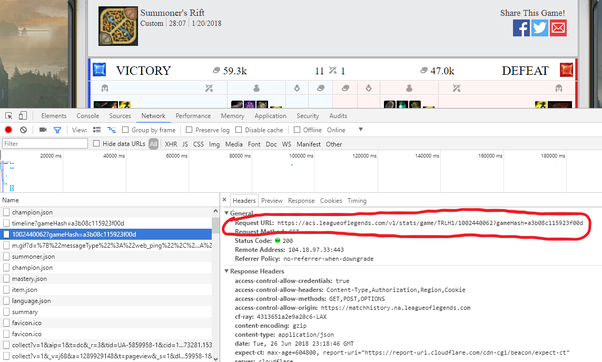

The datasets we'll be using to solve this problem were obtained and wrangled from the match data of the 2018 Spring Split seasons of four different professional Lol eSports leagues: the North Ameica LoL Championship Series (NALCS), the Europe LoL Championship Series (EULCS), LoL Champions Korea (LCK), and LoL Master Series (LMS), plus the 2018 Mid-Season Invitational (MSI), an international tournament similar to the UEFA Champions League in Football/Soccer.  Specifically, for solving the problem, we'll use datasets that contain individual performance data of all players of each match of the eSports Leagues' season, and we'll also use those datasets to create per-game performance datasets.

### Limitations

In the case of the NA LCS 2018 Spring Split, the season started using the Version 8.1 Patch of League of Legends, while the playoff finals series of the season used Version 8.5.  Other LoL eSports leagues around the world used roughly the same range of patches for their 2018 Spring Split seasons, while the 2018 MSI used Version 8.8.  

The reason I mention this, is because with every new patch Riot Games releases for LoL, the changes and tweaks to the game may possibly affect, to a significant degree, the metagame (or meta for short), which means the underlying strategies that can increase chances of success.

For instance, the 8.10 patch gave a significant increase of Experience Points for killing the Rift Scuttler, a non-hostile neutral minion that exists in The River (the diagonal opposite of the Mid Lane), which, in turn made selecting a Jungler champion that is strong at Level 2 for contesting the Scuttler, such as Graves or Xin Zhao, possibly more important.

Another significant meta-shifting patch was 8.11, which made marksman Botlane Carry champions, such as Ashe, Caitlyn, and Tristana, noticeably weaker both in damage output and durability.  This has not only made marksman champions much less prevalent in the Botlane Carry role, but champions once previously thought to be suitable for only Top Laner or Mid Laner roles are starting to make their presence known as Botlane Carries in the 2018 Summer Split, such as Heimerdinger, Vladimir, and Swain.

Therefore, it's possible that any classification models created from and used for the 2018 Spring Split matches will not be as effective if used on 2018 Summer Split or Patch 8.11+ matches.  

### Obtaining and Cleaning/Wrangling the data: 
In-depth details about how the data was obtained and wrangled can be found in this document: [**DataWranglingReport.pdf**](https://github.com/ryanthtra/lol-esports-data-analysis/blob/master/lol_pros_predictor/reports/DataWranglingReport.pdf).  Below, I will present the steps taken to reach the destination datasets used to solve the problem.

#### 1. Discovering the API for obtaining match data
eSports matches were found in [**lolesports.com**](https://www.lolesports.com).  While an individual match that has already concluded can easily be found by just clicking/tapping links alone, finding matches during the 2018 Spring Splits currently requires some manual hacking of the URL to reach them, such as [**NA LCS 2018 Spring Split Week 1**](https://www.lolesports.com/en_US/na-lcs/na_2018_spring/schedule/regular_season/1).

From here, we can click away to find an individual match's details, such as [**NA LCS 2018 Spring Split Week 1, Day 1, Team Liquid vs. TSM**](https://matchhistory.na.leagueoflegends.com/en/#match-details/TRLH1/1002440062?gameHash=a3b08c115923f00d&tab=overview).  On this page, we can get find the API we need by opening the browser's Web Inspector, as shown in Figure 1.




#### 2. Accumulating match IDs for the API
We can find the match IDs the same way we found the API.  Figures 2 and 3 show the match ID strings we need to obtain match data for a particular match.


Therefore, we can accumulate these match IDs by repeating step 1, and then copying and pasting the IDs into a CSV file, in which a portion of the NA LCS 2018 Spring Split is shown in table form below.

```{r message = FALSE}
library(knitr)
kable(head(read.csv("../gameid_data/NALCS_Spring2018.csv")), caption = "Match ID Data, First Six Matches of NA LCS 2018 Spring Split")
```

#### 3. Obtaining Match Data for an Entire Season
Below is the R code used to obtain the top-level match data for a few matches of the NA LCS 2018 Spring Split season.

```{r message=FALSE}
library(httr)
library(dplyr)
library(tidyr)
library(jsonlite)

acs_prefix_domain <- "https://acs.leagueoflegends.com"

# API call helper from response
process_uri <- function(str_uri) {
  #print(str_uri)
  response <- GET(str_uri)
  #print(response$status_code)
  while (response$status_code != 200) {
    Sys.sleep(2)
    response <- GET(str_uri)
  }
  json <- jsonlite::fromJSON(content(response, as = "text"))
  return(json)
}

# URI building helper function
get_acs_match_by_matchid <- function(chr_platform_id, 
                                     num_match_id, 
                                     chr_game_hash = "") {
  uri <- paste(acs_prefix_domain, 
               "/v1/stats/game/", 
               chr_platform_id, 
               "/", num_match_id, 
               ifelse(chr_game_hash != "", paste(
                 "?gameHash=", chr_game_hash, sep = ""), ""), 
               sep = "")
  return(process_uri(uri))
}

# Iterate through match IDs data frame
get_league_match_data_list <- function(league_matchid_df) {
  matchlist <- list()
  for (i in 1:nrow(league_matchid_df)) {
    matchlist[[i]] <- get_acs_match_by_matchid(
      league_matchid_df$Region.ID[[i]], league_matchid_df$Game.ID[[i]], 
      chr_game_hash = league_matchid_df$Hash.ID[[i]])
  }

  return(matchlist)
}

# Getting portion of NA LCS Spring Split matches data
nalcs_matches <- get_league_match_data_list(
  head(read.csv("../gameid_data/NALCS_Spring2018.csv")))
str(nalcs_matches, max.level = 1)
```

We see that we are getting a list of match data.

\pagebreak
Below, we see some details about a single match:
```{r message=FALSE}
str(nalcs_matches[[1]], max.level = 2)
```

\pagebreak
#### 4. Wrangling and cleaning match data into desired datasets.

Here, we will iterate through each individual set of match data, clean it up so that we can get ten observations (representing the ten players in a match), and then concatenate those ten observations into an accumulative dataset.

```{r message=FALSE, warning=FALSE}
#### Creating data frame of champion names linked to their champion IDs.
ddragon_prefix_domain <- "https://ddragon.leagueoflegends.com"
get_champion_data_by_version <- function(chr_version_number = "8.8.2") {
  uri <- paste(ddragon_prefix_domain, "/cdn/", 
               chr_version_number, "/data/en_US/champion.json", sep = "")
  return(process_uri(uri))
}
# Champion data
champions_list <- get_champion_data_by_version()$data
champions_df <- data.frame(NULL)
for (i in 1:length(champions_list)) {
  champions_df <- champions_df %>% bind_rows(data.frame(champions_list[[i]]))
}
champions_df_simple <- champions_df %>%
  select(name, key) %>%
  distinct() %>%
  rename(championId = key) %>%
  mutate(championId = as.numeric(championId))
remove(champions_list)
remove(champions_df)

#@@@@@@@@@@@@@@@@@@@@@@@@@@@@@@@@@@@@@@@@@@@@@@@@@@@@@@@@@@@@
# Concatenates the "participants" DFs of each match together
# combine_teammate_stats determines whether we want to combine the stats of the teammates
# into total numbers 
get_accum_matches_participants <- function(league_matchlist, league_matchid_df, 
                                           combine_teammate_stats = FALSE) {
  league_matches_participants_accum <- data.frame(NULL)

  for (i in 1:length(league_matchlist)) {
    flattened_df <- get_flattened_match_participants_df(
      league_matchlist[[i]]$participants, 
      league_matchlist[[i]]$participantIdentities)
    flattened_df["gameNumber"] <- rep(i, 10)
    flattened_df["isTiebreaker"] <- rep(league_matchid_df[i,]$Tiebreaker, 10)
    flattened_df["isPlayoff"] <- rep(league_matchid_df[i,]$Playoff, 10)
    flattened_df["duration"] <- rep(league_matchlist[[i]]$gameDuration, 10)
    tmp_fdf1 <- flattened_df %>% filter(teamId == "Blue")
    tmp_fdf1["teamName"] <- unname(unlist(c(league_matchid_df[i, rep("Blue.Team", 5)])))
    tmp_fdf2 <- flattened_df %>% filter(teamId == "Red")
    tmp_fdf2["teamName"] <- unname(unlist(c(league_matchid_df[i, rep("Red.Team", 5)])))

    flattened_df <- bind_rows(tmp_fdf1, tmp_fdf2)

    flattened_df['teamRole'] <- NULL
    # Get team roles
    for (j in 1:nrow(flattened_df)) {
      if (flattened_df[j, 'participantId'] == 1 || 
          flattened_df[j, 'participantId'] == 6) {
        flattened_df[j, 'teamRole'] = "TOP"
      } else if (flattened_df[j, 'participantId'] == 2 || 
                 flattened_df[j, 'participantId'] == 7) {
        flattened_df[j, 'teamRole'] = "JUNGLE"
      } else if (flattened_df[j, 'participantId'] == 3 || 
                 flattened_df[j, 'participantId'] == 8) {
        flattened_df[j, 'teamRole'] = "MID"
      } else if (flattened_df[j, 'participantId'] == 4 || 
                 flattened_df[j, 'participantId'] == 9) {
        flattened_df[j, 'teamRole'] = "BOTCARRY"
      } else {
        flattened_df[j, 'teamRole'] = "SUPPORT"
      }
    }
    
    league_matches_participants_accum <- league_matches_participants_accum %>% 
      bind_rows(flattened_df)
  }

  return(league_matches_participants_accum)
}

#@@@@@@@@@@@@@@@@@@@@@@@@@@@@@@@@@@@@@@@@@@@@@@@@@@@@@@@@@@@@
get_flattened_match_participants_df <- function(match_participants_df, match_participantids_df) {
  # uses jsonlite flatten() function
  ret_df <- match_participants_df %>%
    select(-stats, - timeline) %>%
    bind_cols(match_participantids_df$player) %>%
    inner_join(champions_df_simple) %>%
    inner_join(match_participants_df$stats) %>%
    inner_join(match_participants_df$timeline %>%
                 flatten())
  # Change teamId = 100/200 to Blue/Red, replace NA's in the Deltas with 0s
  ret_df <- ret_df %>%
    mutate(teamId = replace(teamId, grepl('100', teamId), 'Blue')) %>%
    mutate(teamId = replace(teamId, grepl('200', teamId), 'Red'))

  return(ret_df)
}

# Note: just the first six matches
nalcs_season_match_player_data <- get_accum_matches_participants(
  nalcs_matches, head(read.csv("../gameid_data/NALCS_Spring2018.csv")))
kable(nalcs_season_match_player_data[1:20,] %>%
        select(participantId, summonerName, win, kills, 
               deaths, assists, teamRole, role, lane), 
      caption = "Sample of Match-By-Match Player Data")
```

The table above shows just a portion of the data set we'll be using to solve this problem.  Additionally, we'll use this dataset to create the per-game averages performance dataset, as presented in the code below.

```{r message=FALSE, warning=FALSE}
# Gets individual per-game average performace data
get_league_season_summoner_avgs <- function(league_matches_player_stats) {
  league_season_participants_accum <- league_matches_player_stats

  # Create avg stats DF groups by lane and role
  league_season_participants_accum <-
  (league_season_participants_accum %>%
  group_by(teamName, summonerName, teamRole) %>%
  summarize_at(vars(duration, kills:assists, totalDamageDealt:trueDamageDealt, 
                    totalDamageDealtToChampions:firstBloodKill, 
                    firstTowerKill:firstInhibitorAssist, 'creepsPerMinDeltas.10.20', 
                    'creepsPerMinDeltas.0.10', 'xpPerMinDeltas.10.20', 
                    'xpPerMinDeltas.0.10', 'goldPerMinDeltas.10.20', 
                    'goldPerMinDeltas.0.10', 'damageTakenPerMinDeltas.10.20', 
                    'damageTakenPerMinDeltas.0.10'), mean)) %>%
  # Tallying wins and losses by summoner name
  inner_join(league_season_participants_accum %>%
    group_by(teamName, summonerName, teamRole, win) %>%
    tally() %>%
    spread(win, n) %>% # "transposes" the DF so that TRUE (win) and FALSE (loss) are the column names
    rename('losses' = 'FALSE', 'wins' = 'TRUE') %>% # renames the T/F columns to W/L
    mutate_at(vars(wins, losses), funs(replace(., is.na(.), 0))))

  # Adding KDA Ratio column
  league_season_participants_accum <- league_season_participants_accum %>%
    mutate(KDA = (kills + assists) / deaths)

  # Reordering columns - teamName, wins, losses, <everything else>
  league_season_participants_accum <- league_season_participants_accum[
    , c(1, 2, 55, 54, 3:7, 56, 8:53)]
}
nalcs_matches_player_stats <- read.csv(
  "../datasets/nalcs/nalcs_spring2018_match_player_stats.csv")
nalcs_season_player_avgs <- get_league_season_summoner_avgs(nalcs_matches_player_stats)
kable(nalcs_season_player_avgs[1:20, 2:10], caption = 
        "Sample of Per Game Player Averages, NA LCS 2018 Spring Split")
```
