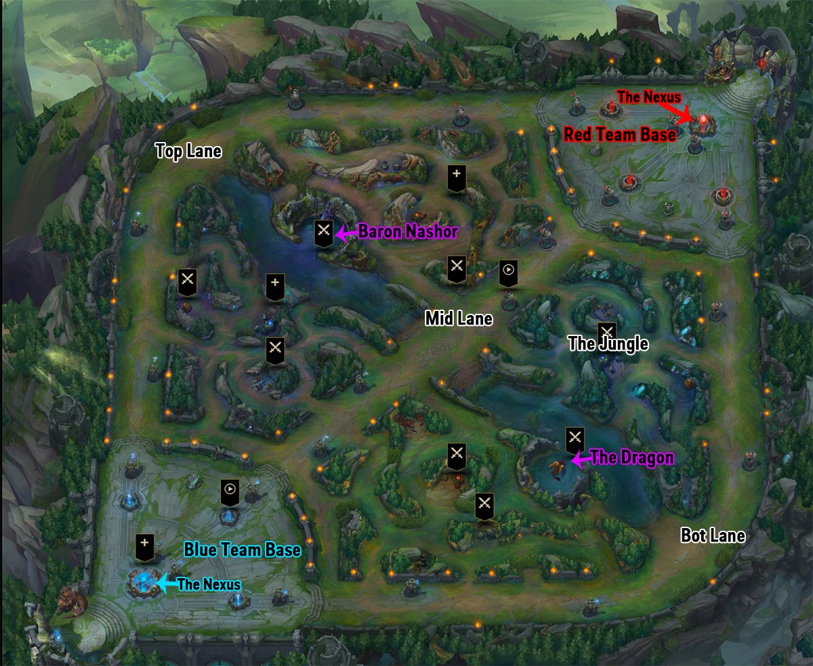

<style type="text/css">
.title {
  display: none;
}

.subtitle-text {
  font-size: 68px;
  text-align: center;
}
.img-subtitle {
  width: 68px;
  height: 68px;
  margin-bottom: 10px;
}
.rift-map {
  text-align: center;
}
.img-rift-map {
  width: 70%;
  height: 70%;
}
</style>

```{r setup, include=FALSE}
knitr::opts_chunk$set(echo = TRUE)
```


<p class="subtitle-text">
  KN YUR RE
</p>


## Introduction
League of Legends (LoL) is a multiplayer online battle arena (MOBA) videogame by Riot Games.  The primary game mode for LoL is Summoner's Rift (also the name of the arena's map), in which two teams of five players vie to destroy their opponents' base, called the Nexus.  For more detailed information about the game, please see <a href="https://en.wikipedia.org/wiki/League_of_Legends#Gameplay" target="_blank">League of Legends on Wikipedia.</a>

Each player in a match chooses one of 141 unique avatars, called champions, to represent them, and each champion has its own unique blend of attributes, skills, and abilities.  Each one of these 141 champions is classified into one of six categories: assassin, fighter, mage, marksman, support, or tank.

Additionally, each player on each competing team in a match plays one of five standard team roles: ***Top Laner***, ***Jungler***, ***Middle (Mid) Laner***, ***Bottom Lane (Botlane) Carry***, or ***Support***.  While each role performs specific duties, each can also be identified by its location on the map near the beginning of a match.

<p class="rift-map"></p>

The ***Top Laners*** traverse along the dirt path that travels along the west and north perimeters of the map.  Near the start of the match they usually combat enemy minions and each other at the northwest corner of the map.  This type of combat at the beginning of the match is called the **Laning Phase**.

The ***Mid Laners*** traverse along the dirt path that cuts straight across the diagonal of the map connecting the two opposing bases.  They, too, combat enemy minions and each other during the Laning Phase, where they typically compete right at the center of the map.

The ***Botlane Carries*** and ***Supports*** traverse along the dirt path that travels along the south and east perimeters of the map.  Their laning phase typically occurs at the southeast corner of the map.  The ***Botlane Carries*** deliver damage to their opponents and enemy minions, while the ***Supports*** play an auxiliary role by providing protection to their botlane teammates.

Finally, the ***Junglers*** traverse in the forest-like areas between the three lanes.  One team's jungle is in the west and south "triangles", while the other team's is in the north and east triangular areas.  During the Laning Phase the ***Junglers*** are combating the monsters that inhabit these areas.  They may occasionally encounter each other, especially if one Jungler "invades" their opponents' jungle areas.

Therefore, it's nearly as easy to identify team roles in a League of Legends match as it is to identify the nine positions of the defensive players in a baseball game.  The botlane is a little trickier, since both ***Carries*** and ***Supports*** are there, but by observing their behaviors during the laning phase the two roles are fairly simple to distinguish.
